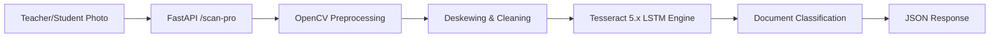

# 🎓 School ERP-Ready Smart OCR Engine

[](https://fastapi.tiangolo.com/)
[](https://www.python.org/)
[](https://www.docker.com/)
[](https://github.com/tesseract-ocr/tesseract)
[](https://render.com/)

An enterprise-grade, high-accuracy OCR system specifically designed for **School ERPs**. It supports **English**, **Nepali**, and **Math Equations** simultaneously, with advanced image preprocessing to handle real-world classroom photos.

---

## 🚀 Key Features

- **🌐 Multi-Language Support:** Seamlessly reads English and Nepali text.
- **🔢 Advanced Math OCR:** Uses `tessdata_best` models to extract mathematical equations.
- **📐 Pro Deskewing:** Automatically detects and fixes photos taken at an angle.
- **📂 Smart Classification:** Automatically identifies document types:
  - 📝 **Marksheets**
  - 🆔 **Student ID Cards**
  - 📄 **Admission Forms**
  - 🧾 **Fee Receipts**
- **🛠️ Image Preprocessing:** Adaptive thresholding and denoising using **OpenCV** to fix low-light or blurry mobile captures.
- **⚡ Performance Optimized:** Multi-threaded processing to handle multiple scans without blocking.
- **☁️ Render Ready:** Specifically optimized for Render's 512MB RAM Free Tier with safe auto-resizing.

---

## 🏗️ Architecture



---

## 🛠️ Installation & Local Setup

### 🐳 Using Docker (Recommended)
```bash
docker build -t school-ocr .
docker run -p 10000:10000 school-ocr
```

### 🐍 Manual Setup
1. **Install Tesseract 5.0+** with Nepali and Math packs.
2. **Install Dependencies:**
   ```bash
   pip install -r requirements.txt
   ```
3. **Run Server:**
   ```bash
   uvicorn main:app --host 0.0.0.0 --port 10000
   ```

---

## ☁️ Deployment (100% Free on Render)

1. **Create Web Service:** Connect this repo to Render.
2. **Runtime:** Select **Docker**.
3. **Tier:** Choose **Free**.
4. **Keep-Alive (Crucial):**
   - Go to [cron-job.org](https://cron-job.org).
   - Set up a job to ping `https://your-app.onrender.com/health` every **10 minutes**.
   - This prevents the "cold-start" delay and keeps the OCR always ready.

---

## 📡 API Documentation

### `POST /scan-pro`
Main endpoint for high-quality OCR.

**Request:** `multipart/form-data` with a `file`.

**Response:**
```json
{
  "success": true,
  "filename": "marksheet_photo.jpg",
  "text": "Extracted text content here...",
  "document_type": "Marksheet",
  "confidence_avg": 89.5
}
```

### `GET /health`
Used by pinger services to keep the app awake.

---

## 💡 Pro Tips for Accuracy
- **Resize Before Upload:** If an image is larger than 1500px, the engine will auto-resize it to protect memory, but pre-resizing in the browser saves bandwidth!
- **Lighting:** Even though we use **Adaptive Thresholding**, clear lighting always yields >95% accuracy.

---

## 📜 License
Distributed under the MIT License. See `LICENSE` for more information.

---
**Built for the future of Digital Education. 🇳🇵**
