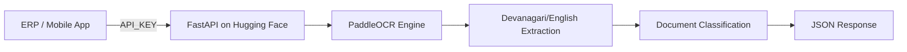

# 🎓 School ERP-Ready Smart OCR Engine (PaddleOCR Edition)

[](https://fastapi.tiangolo.com/)
[](https://www.python.org/)
[](https://www.docker.com/)
[](https://github.com/PaddlePaddle/PaddleOCR)
[](https://huggingface.co/spaces)

An enterprise-grade, high-accuracy OCR system specifically designed for **School ERPs**. Now powered by **PaddleOCR** and optimized for **Hugging Face Spaces (16GB RAM)** for lightning-fast results.

---

## 🚀 Key Features

- **🧠 Powered by PaddleOCR:** Far more accurate and faster than Tesseract.
- **🇳🇵 Full Devanagari Support:** Native support for **Nepali** and **Hindi** scripts.
- **⚡ 16GB RAM Optimized:** Runs on Hugging Face Spaces for professional-grade performance.
- **🔒 Private API Security:** Protect your OCR engine with `API_KEY` authentication.
- **📐 Auto-Correction:** Built-in orientation detection and deskewing (angle correction).
- **📂 Smart Classification:** Automatically identifies document types:
  - 📝 **Marksheets**
  - 🆔 **Student ID Cards**
  - 📄 **Admission Forms**
  - 🧾 **Fee Receipts**
- **⚡ WebSocket Support:** Real-time processing logs for a better user experience.

---

## 🏗️ Architecture



---

## ☁️ Deployment (Free & Unlimited on Hugging Face)

1. **Create a Space:** Go to [Hugging Face Spaces](https://huggingface.co/new-space).
2. **SDK:** Select **Docker**.
3. **Template:** Choose **Blank**.
4. **Connect Repo:** Push this code to your Space's repository.
5. **Security (Important):** 
   - Go to **Settings** > **Variables and Secrets**.
   - Add a new **Secret** named `API_KEY`.
   - Set it to your desired secret password (e.g., `my_secure_erp_key`).
6. **Keep-Alive (Prevent Sleep):**
   - Use [cron-job.org](https://cron-job.org) to ping your Space URL every **30 minutes**.
   - This keeps the 16GB RAM instance active 24/7 for free.

---

## 📡 API Documentation

### `POST /scan-pro`
Secure endpoint for production OCR.

**Headers:**
- `x-api-key`: Your secret API key (defined in HF Secrets).

**Request:** `multipart/form-data` with a `file`.

**Response:**
```json
{
  "success": true,
  "filename": "marksheet.jpg",
  "text": "Extracted content...",
  "document_type": "Marksheet",
  "confidence_avg": 94.2
}
```

### 🐘 PHP Integration Example
```php
<?php
$api_url = "https://YOUR_USER-YOUR_SPACE.hf.space/scan-pro";
$image_path = 'student_id.jpg';

$curl = curl_init();
curl_setopt_array($curl, [
    CURLOPT_URL => $api_url,
    CURLOPT_POST => true,
    CURLOPT_RETURNTRANSFER => true,
    CURLOPT_HTTPHEADER => [
        'x-api-key: YOUR_SECRET_KEY_HERE'
    ],
    CURLOPT_POSTFIELDS => [
        'file' => new CURLFile($image_path)
    ],
]);

$response = curl_exec($curl);
$result = json_decode($response, true);
echo "Result: " . $result['text'];
curl_close($curl);
?>
```

---

## 💡 Pro Tips for Accuracy
- **Image Quality:** PaddleOCR is very robust, but clear photos always give 99%+ accuracy.
- **Private Space:** If you make your Space "Private", you'll need to pass an `Authorization: Bearer HF_TOKEN` header in your requests.

---

## 📜 License
Distributed under the MIT License.

---
**Advanced OCR for the future of Digital Education. 🇳🇵**
